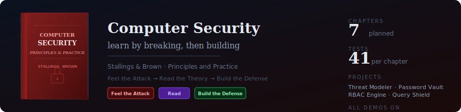
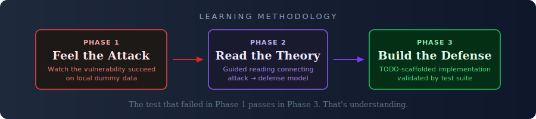

<p align="center">
  
</p>

> You tried to find every threat in a small web app using intuition. A systematic analysis found 24 threats across 8 assets. You missed the backup stored on the same server, the email spoofing vector, and the file upload that could overwrite server files. — *Chapter 1, Phase 1*

This repo turns Stallings & Brown's *Computer Security: Principles and Practice* into hands-on projects. Every chapter follows the same arc: **watch the attack succeed, read the theory, then build the defense.**

<p align="center">
  
</p>

Each project comes with a test suite. Your implementation is correct when all tests pass — including the test that recreates the exact attack scenario from Phase 1, but this time your defense handles it.

---

## How It Works

**Phase 1 — Feel the Problem.** A Python script demonstrates the vulnerability on local dummy data. No real exploits, no network attacks — just a clear demonstration of *why the defense matters*. You see weak password hashes cracked in milliseconds. You watch SQL injection bypass authentication. You see an "intern" account delete admin files.

**Phase 2 — Read.** A guided reading connecting what you just witnessed to specific textbook sections. You know *why* you're reading — because you just saw the attack work.

**Phase 3 — Build.** A TODO-scaffolded project with types and helpers provided. You implement the defense. A test suite with 4 tiers validates your work:

```
test_basic.py       →  Does the defense work at all?
test_edges.py       →  Does it handle weird inputs?
test_hard.py        →  Does it stop the Phase 1 attack?  ← the real test
test_properties.py  →  Does the full pipeline hold together?
```

---

## Chapters

| | Project | What You Build | Tests |
|---|---|---|---|
| **Ch 1** | [Threat Modeler](ch1-threat-modeler/) | CIA impact assessment · threat mapping · attack surface analysis · risk scoring engine | 41 |
| **Ch 2** | Crypto Channel | Encrypt/sign/verify message pipeline using `cryptography` library | — |
| **Ch 3** | Password Vault | Salted hashing (bcrypt/argon2) · rate limiting · TOTP second factor | — |
| **Ch 4** | RBAC Engine | Role hierarchy · permission evaluation · deny-override · audit logging | — |
| **Ch 5** | Query Shield | Parameterized queries · input validation · query anomaly detection | — |
| **Ch 10** | Bounds Checker | Safe string library in C with canary values and overflow detection | — |
| **Ch 13** | Log Sentinel | Signature + anomaly IDS · alert correlation · severity classification | — |

## Chapter 1: Threat Modeler

Phase 1 describes a small e-commerce app (MiniShop) and asks you to identify every threat. Then it reveals what you missed — and shows you the structured framework that finds them all.

After reading, you implement 5 functions:

```
TODO 1: CIA Impact Assessment     → rate confidentiality, integrity, availability per asset
TODO 2: Threat Mapping            → validate and classify threats (passive vs active)
TODO 3: Attack Surface Analysis   → identify entry points with exposed asset mapping
TODO 4: Risk Scoring              → likelihood × impact, severity classification
TODO 5: Report Generation         → orchestrate the full pipeline, produce summary stats
```

```bash
cd ch1-threat-modeler
pip install pytest

python feel_the_problem.py    # Watch the attack succeed
# Read Chapter 1 with reading_guide.md
pytest tests/ -v              # Build until all 41 tests pass
```

## Safety

All Phase 1 demos operate on local dummy data. No real credentials, no network attacks, no exploit code. The scripts demonstrate *concepts* — why something is vulnerable — not techniques for attacking real systems.

## Part of a Larger System

| Repo | Domain | Method |
|---|---|---|
| **This repo** | Computer Security | Feel the attack → Read → Build the defense |
| [cfo-microeconomics](https://github.com/NikolasNeofytou/cfo-microeconomics) | Economics | Puzzle → Read → Model → Debate → Data |
| [clrs-algorithms](https://github.com/NikolasNeofytou/clrs-algorithms) | Algorithms | Feel the slowness → Read → Build and benchmark |
